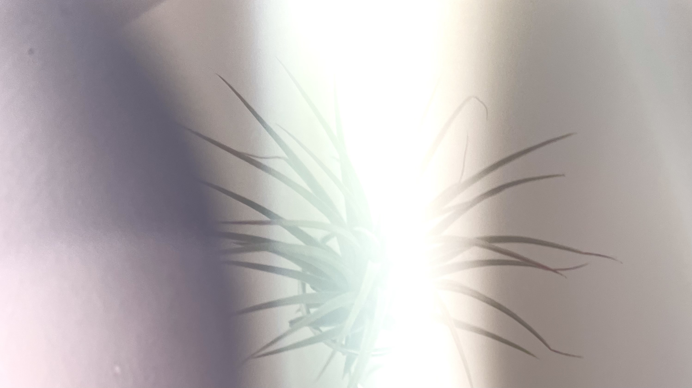
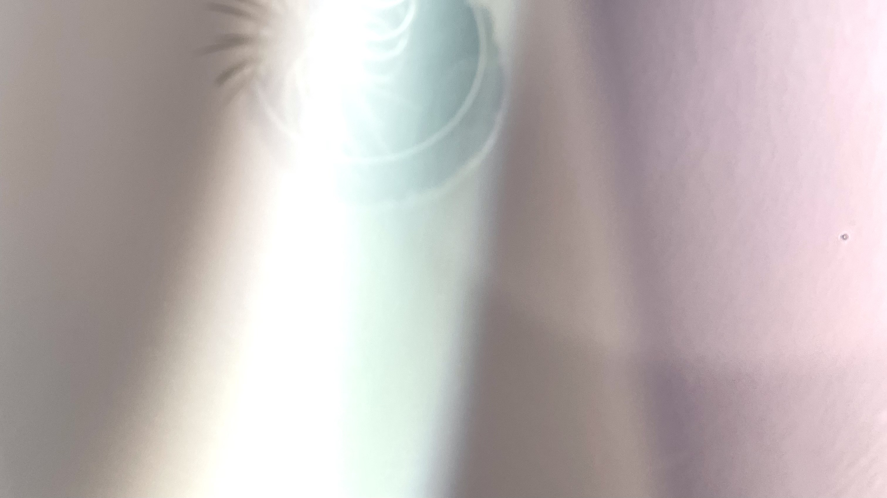

 

우선 가게에 애정을 갖고 이곳을 방문해 주신 모든 분들께 고마움의 인사를 전합니다. 
공간은 임의롭길 희망하나 몇 가지의 유의점이 있어 염두에 두시길 바랍니다.

 

원하시는 좌석을 자유롭게 이용해 주시되 탁자와 의자의 이동을 삼가주시기 바랍니다. 
더불어 의자가 네 개 이상 놓인 좌석의 경우 입장하시는 손님의 인원에 따라 자리의 이동을 부탁드릴 수 있는 점 양해 부탁드립니다.

 

앉아계신 의자는 이전, 이후에 또 다른 손님께서 앉게 되는 공용 의자입니다. 
해서 의자를 차거나 상판 위에 발을 올리는 행위를 하지 않아 주셨으면 좋겠습니다.

 

끝으로 이곳에 머문 시간이 일후에 포근한 기억이 되길 희망하며 매양 정제된 것들을 제공하려 노력을 기울이겠습니다.

<!--
물을 데워 김이 나고 이 물이 흘러내려 커피를 적실 때 우리가 wet aroma(웨트 아로마)라 일컫는 향을 발산합니다. 
이러한 과정들이 펼쳐진다면 무릇 좋은 분위기를 풍기는 일이 아닐런지요. 
가게의 상호와 상징하는 이미지에 쓰인 ‘emme'란 단어는 '이메'라 발음하며 '김을 내다.', '흘러나오다.', '발산시키다.', '분위기를 풍기다.'의 의미를 가졌으니 우리 앞에 놓인 음료가 거쳐 온 길과 꽃의 인상을 이름에 담았다 해도 좋겠습니다.

 

 

공간은 따뜻한 사연들을 모아 매양 편안하길 희망합니다. 
이곳의 사물들은 거개가 여러 나라에서 각기 다른 시간을 지냈습니다. 
개체들은 각자의 이야기를 가진 채 여기 놓이게 되었으니 머무는 동안 사물의 사연을 미루어 보는 것도 좋을 것이라 생각합니다. 
이로 인해 짧은 동안이나마 우리가 안온하다면 더할 나위 없겠습니다.

 

 

공간은 임의롭길 희망하나 몇 가지의 유의점이 있어 염두에 두시길 바랍니다. 
아이와 반려동물의 동반이 어렵다는 말씀을 남깁니다. 
여섯 분 이상의 단체 손님이 앉을 수 있는 자리가 마련되어 있지 않아 매장 이용이 어렵습니다. -->
