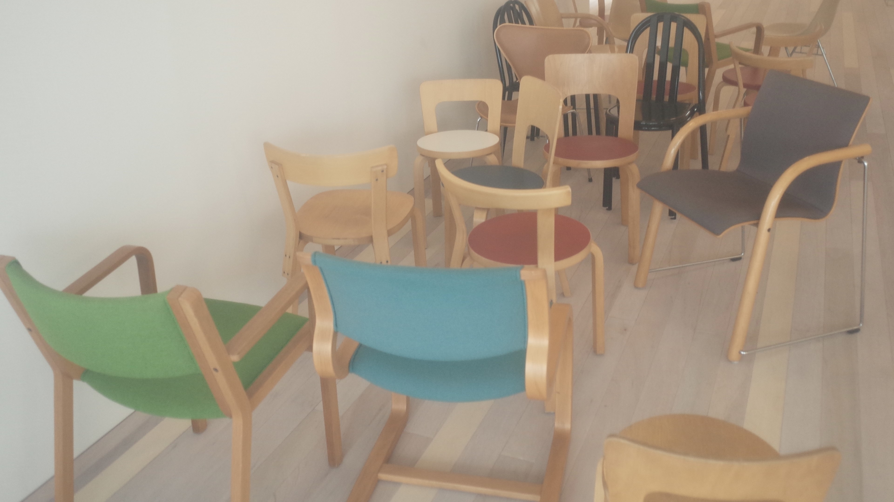

 

물을 데워 김이 나고 이 물이 흘러내려 커피를 적실 때

우리가 wet aroma(웨트 아로마)라 일컫는 향을 발산합니다.

이러한 과정들이 펼쳐진다면 무릇 좋은 분위기를 풍기는 일이 아니겠습니까?

가게의 상호와 상징하는 이미지에 쓰인 'emme'란 단어는 '이메'라 발음하며

'김을 내다.', '흘러나오다.', '발산시키다.', '분위기를 풍기다.'의 의미를 가졌으니

우리 앞에 놓인 음료가 거쳐 온 길과 꽃의 인상을 이름에 담았다 해도 좋겠습니다.

 

공간은 따뜻한 사연들을 모아 매양 편안하길 희망합니다.

이곳의 사물들은 거개가 여러 나라에서 각기 다른 시간을 지냈습니다.

개체들은 각자의 이야기를 가진 채 여기 놓이게 되었으니 

머무는 동안 사물의 사연을 미루어 보는 것도 좋을 것이라 생각합니다. 

이로 인해 아주 짧은 동안이나마 우리가 안온하다면 더할 나위 없겠습니다.

 

